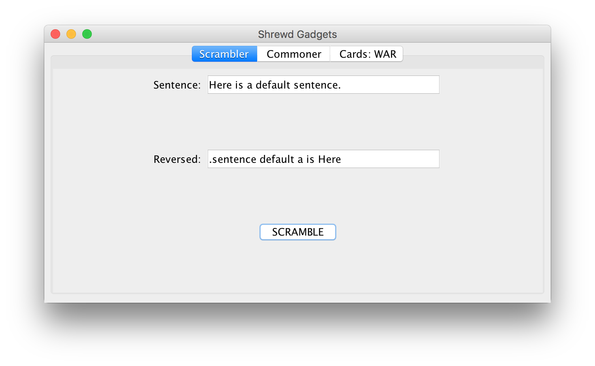

# gadgets.shrewd.gui
A simple Swing application to utilize with the core library.

## Packaging
Since Shrewd Gadgets does not have it's own remote Maven repository developers will need
to install the package the application manually.

To package locally:
 - Install the parent POM locally; for more details visit the [README](https://github.com/Shrewd-Gadgets/gadgets.shrewd.maven).
 - Install the core library locally; for more details visit the [README](https://github.com/Shrewd-Gadgets/gadgets.shrewd.core).
 - Clone this [repository](https://github.com/Shrewd-Gadgets/gadgets.shrewd.gui) onto you local machine.
 - Navigate into the root of the project; this is directory containing the `pom.xml` file.
 - Build and package this component
 ```bash
 [user@localhost:~/gadgets.shrewd.gui] mvn clean package
 ```
 - This should produce a compiled application JAR in a local `target` directory
 - The JAR can be run by executing (note that the `X.X.X` portion will be the current local version on the project)
 ```bash
 [user@localhost:~/gadgets.shrewd.gui] java -jar target/gadgets.shrewd.gui-X.X.X-uber.jar
 ```
 This should start the application and a simple window should appear.
 
 ## Walkthrough
 ### Scrambler
 The Scrambler pane allows you to enter sentence and then 
 see the sentenced reversed.
 
 
 
 ### Commoner
 The Commoner pane allows you to enter two pieces of text and
 then isolate the common characters shared between them.
  
  
  
  
  ### War
  The War card game simulator channels the exciting action of naming
  two unplayable computer characters, then reading the results of their
  battle in the winner-take-all card game.
  
  Built on a card deck randomizer, each time you 'play' you won't know who'll win!
  
  
 